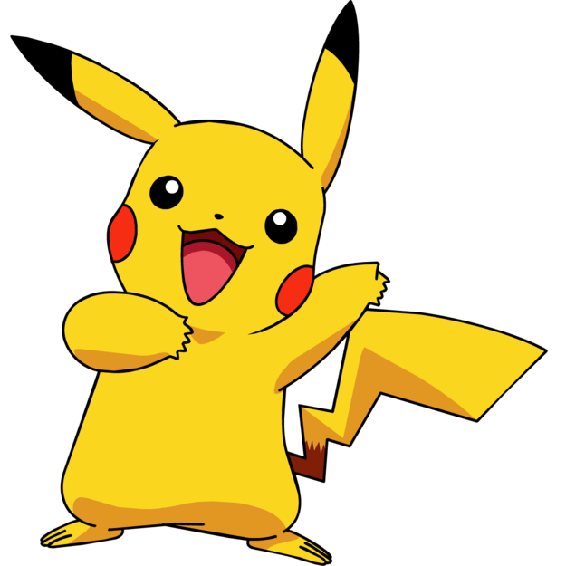

## Welcome to our README about the game: "The Pokemon's Challenge"

 

### This Object Oriented Programming task was written by:

* Etay Matzliah - 205987795
* Eran Levy - 311382360
    
    The main topic is developing logic for a game where a group of agents needs to eat Pokemon's as much as possible in few steps as possible on directed graph.
    
    #### Game rules:
    The agents earn points while collecting a pokemon. Each pokemon have different value.
    There is a clock that counting backwards and when the clock gets to zero the game ends.
    The direction of the agents movement is based on the value of the pokemon.
    
    Our project is divided to two parts:
    ### Part 1 : building the graph and his algorithms 
    
    In this part we have 4 important interfaces:
    
  1 . directed_weighted_graph - this interface implemented by the DWGraph_DS class and represents a directional weighted graph.
  
  2 . node_data - this interface implemented by the NodeData class and represents a vertex in our graph.
  
  3 . edge_data - this interface implemented by the EdgeData class and represents a edge in our graph.
  
  4 . dw_graph_algorithms - this interface implemented by the WDGraph_Algo class and represents bunch of algorithms based on the graph we've created in DGraph.

   ### part 2 : building the Pokemon's challenge game
   
   in this part we have a numbers of class that we summarize them here:
   
  1 . Ex2 - this class represents the main class of the program, inside her we also representing the LoginGUI 
  
  2 . Game_Manager - 
  
  3 . CL_Agent - this class represents the Agents in the game 
  
  4 . CL-Pokemon - this class represents the Agents in the game 
  
  5 . Arena - 
  
  6 . GameGUI - this class represents all the steps to make the GUI of the grpah 
  
  
  
  #### The algorithms that we used in this project is : 
  
1 . Dijkstra algorithms : to get the shortestPathDist and the shortestPath

2 . BFS algorithms : to know if in the graph there is a valid path from each node to each other node
   
  #### Time complexity of the algorithms:
	
- Dijkstra algorithms = O(|E|*log|V|)
- BFS algorithms = O ( v + E ) 

		V = vertex
		E = edges
 

##### for more information you can see our Wiki page!
